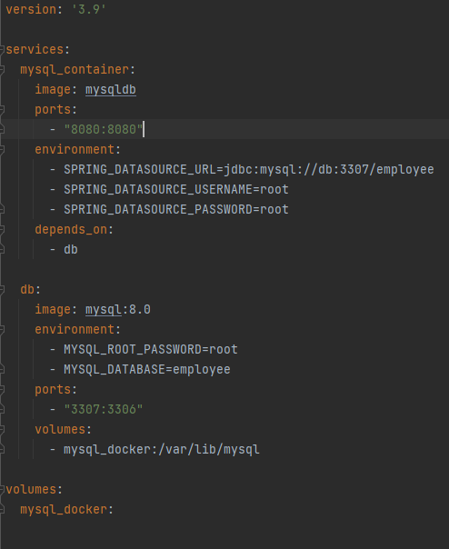

# Spring-Boot-CRUD-Example
MYSQL for persistence SWAGGER notations Import YAML Services folder Features
Building robust and scalable REST APIs is a common requirement for modern web development.

**Step 1. Create a New Project**

We created an application where we use REST APIs for CRUD operation using Spring Boot Framework, We will learn about 
request validation, error handling, testing, API Documentation, and deployment.
First we start using the [Spring Initializr](https://start.spring.io/) online tool and choose the required dependecies.

After that, We add others dependency in **pom.xml** file.

    <dependency>
        <groupId>io.springfox</groupId>
        <artifactId>springfox-swagger2</artifactId>
        <version>2.9.2</version>
    </dependency>

    <dependency>
        <groupId>io.springfox</groupId>
        <artifactId>springfox-swagger-ui</artifactId>
        <version>2.9.2</version>
    </dependency>

**Step 2. Create Model and Configure Persistence**

**Step 3. Create REST Resource/Controller**

**Step 4. Configure Error Handling**

**Step 5. Configure Request Validation**

**Step 6. Add yaml configuration**

**Step 7. BRING CUSTOMERS BASED ON STATUS - /{STATUS} - ACTIVE/INACTIVE (NEW METHOD)**

**Step 8. Docker**
First we need to download and install [Docker](https://www.docker.com/products/docker-desktop/) in our Desktop. Confirm
that you have installed Docker running the next line in CMD after `docker --version` to confirm the Docker installation.
We search the Images that we need MySql in this case, we should go to [Docker Hub](https://hub.docker.com/) and in the
search box, you must search MySQL

Click in the first option and copy the command line in the corned `docker pull mysql`.

When you run command line in CMD it will start to download the MySql Images.

We could confirm the images installation with the command line `docker images`.

Dockerfile

`FROM openjdk:17

COPY target/Spring-Boot-CRUD-Example-0.0.1-SNAPSHOT.jar /app.jar

ENTRYPOINT ["java", "-jar", "/app.jar"]`

docker-compose.yml

application.yml 

Bibliography

_**Spring Boot REST API Example – Step-by-Step Guide:**_
https://howtodoinjava.com/spring-boot/spring-boot-rest-api-example/

_**Documentar un API REST con Swagger y Spring Boot:**_
https://www.oscarblancarteblog.com/2020/08/28/documentar-un-api-rest-con-swagger-y-spring-boot/